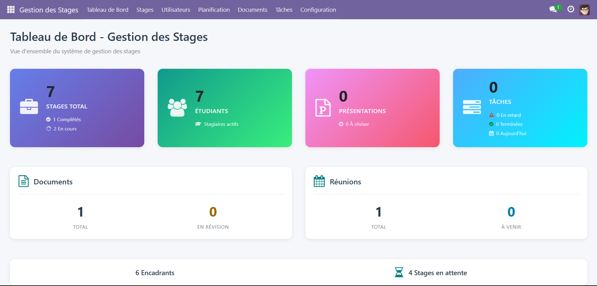

# 🎓 Système de Gestion des Stages - TechPal Casablanca

[](https://www.odoo.com)
[](https://www.python.org)
[](https://www.postgresql.org)
[](LICENSE)

> Plateforme complète de gestion des stages développée pour TechPal Casablanca dans le cadre d'un stage d'été 2024-2025.

---

## 📋 Table des Matières

- [Vue d'ensemble](#vue-densemble)
- [Fonctionnalités](#fonctionnalités)
- [Architecture](#architecture)
- [Prérequis](#prérequis)
- [Installation](#installation)
- [Documentation](#documentation)
- [Captures d'écran](#captures-décran)
- [Technologies](#technologies)
- [Auteur](#auteur)

---

## 🎯 Vue d'ensemble

Le **Système de Gestion des Stages TechPal** est une solution complète développée sur Odoo 17 permettant de gérer
l'intégralité du cycle de vie des stages, de la candidature à l'évaluation finale.

### Objectifs du projet

- Centraliser la gestion des stages de TechPal
- Simplifier la communication entre stagiaires, encadrants et administration
- Automatiser la génération de documents (conventions, attestations, PV)
- Assurer un suivi transparent et efficace des stages
- Fournir des tableaux de bord et statistiques en temps réel

---

## ✨ Fonctionnalités

### 🔐 Gestion des utilisateurs & rôles

- 4 rôles : Admin, Coordinateur, Encadrant, Stagiaire
- Profils utilisateurs détaillés
- Sécurité par groupes et règles d'enregistrement

### 📊 Gestion des stages

- Proposition et validation de sujets de stage
- Affectation automatique des encadrants
- Suivi de l'avancement (Kanban, To-Do List)
- Workflow complet : Brouillon → Soumis → Approuvé → En cours → Terminé → Évalué

### 📄 Gestion documentaire

- Upload de documents (CV, rapports, présentations)
- Workflow de révision et approbation
- Versioning des documents
- Système de feedback structuré

### 🎤 Soutenances

- Planification des soutenances
- Attribution de jury
- Dépôt et validation de présentations
- Génération automatique de procès-verbaux

### 📅 Suivi & communication

- Messagerie interne (Chatter Odoo)
- Système de notifications (email + in-app)
- Calendrier partagé pour réunions
- Activités et alertes automatiques

### 📈 Reporting & statistiques

- 5 rapports PDF générés automatiquement :
    - Convention de stage
    - Attestation de stage
    - Procès-verbal de soutenance
    - Rapport d'évaluation
    - Rapport de synthèse
- Dashboard personnalisé par rôle (OWL Component)
- Statistiques en temps réel

### ✅ Gestion des tâches

- Création et assignation de tâches
- Suivi de progression
- Alertes pour tâches en retard
- Workflow : À faire → En cours → Terminé

---

## 🏗️ Architecture

```
odoo17-internship/
├── config/
│   └── odoo.conf                 # Configuration Odoo
├── custom-addons/
│   ├── internship_management/     # Module principal
│   │   ├── __manifest__.py
│   │   ├── models/               # Modèles de données
│   │   │   ├── internship_stage.py
│   │   │   ├── internship_student.py
│   │   │   ├── internship_supervisor.py
│   │   │   ├── internship_document.py
│   │   │   ├── internship_presentation.py
│   │   │   ├── internship_meeting.py
│   │   │   ├── internship_task.py
│   │   │   ├── internship_area.py
│   │   │   ├── internship_skill.py
│   │   │   └── internship_document_feedback.py
│   │   ├── views/                # Vues XML
│   │   │   ├── internship_stage_views.xml
│   │   │   ├── internship_student_views.xml
│   │   │   ├── internship_supervisor_views.xml
│   │   │   ├── internship_document_views.xml
│   │   │   ├── internship_presentation_views.xml
│   │   │   ├── internship_meeting_views.xml
│   │   │   ├── internship_todo_views.xml
│   │   │   ├── internship_area_views.xml
│   │   │   ├── internship_skill_views.xml
│   │   │   ├── internship_security_views.xml
│   │   │   ├── internship_document_feedback_views.xml
│   │   │   ├── internship_dashboard_action.xml
│   │   │   └── internship_menus.xml
│   │   ├── reports/              # Rapports PDF
│   │   │   ├── internship_report_templates.xml
│   │   │   ├── internship_reports.xml
│   │   │   └── internship_reports.py
│   │   ├── security/             # Sécurité
│   │   │   ├── internship_security.xml
│   │   │   └── ir.model.access.csv
│   │   ├── data/                 # Données initiales
│   │   │   ├── sequences.xml
│   │   │   ├── internship_cron.xml
│   │   │   ├── internship_meeting_mail_templates.xml
│   │   │   ├── mail_activity_type_data.xml
│   │   │   └── internship_demo_data.xml
│   │   ├── static/src/           # Assets frontend
│   │   │   ├── dashboard/
│   │   │   │   ├── dashboard.js
│   │   │   │   ├── dashboard.xml
│   │   │   │   └── dashboard.scss
│   │   │   └── scss/
│   │   └── wizard/               # Assistants
│   │       └── (modules wizard)
│   └── internship_theme/         # Module thème personnalisé
│       ├── __manifest__.py
│       ├── views/
│       │   └── login_template.xml
│       └── static/src/scss/
│           └── login.scss
├── docs/                         # Documentation
│   └── images/
│       ├── dashboard.png
│       ├── login_page.png
│       └── stages_kanban.png
├── odoo-source/                  # Source Odoo 17
├── filestore/                    # Stockage fichiers
├── logs/                         # Logs système
└── odoo-venv/                    # Environnement virtuel Python
```
---

## 💻 Prérequis

- **Python** : 3.11 ou supérieur
- **PostgreSQL** : 16.x
- **Odoo** : 17.0
- **wkhtmltopdf** : 0.12.6 (pour génération PDF)
- **OS** : Windows 10/11, Ubuntu 20.04+, ou macOS 12+

---

## 🚀 Installation

Voir le guide détaillé : [INSTALLATION.md](INSTALLATION.md)

### Installation rapide

```bash
# 1. Cloner le projet
git clone https://github.com/techpal-casablanca/odoo17-internship.git
cd odoo17-internship

# 2. Créer environnement virtuel
python -m venv odoo-venv
odoo-venv\Scripts\activate  # Windows
# source odoo-venv/bin/activate  # Linux/Mac

# 3. Installer dépendances Odoo
pip install -r odoo-source/requirements.txt

# 4. Créer base de données PostgreSQL
createdb -U postgres internship_management_db

# 5. Configuration Odoo
# Éditer config/odoo.conf selon votre environnement

# 6. Lancer Odoo
python odoo-source/odoo-bin -c config/odoo.conf

# 7. Installer les modules
# Interface web : Applications > Rechercher "Gestion des Stages TechPal" > Installer
```

### Configuration minimale

- **Python** : 3.11+
- **PostgreSQL** : 16+
- **RAM** : 4 GB minimum
- **Espace disque** : 5 GB libres

---

## 📚 Documentation

| Type | Format | Description |
|------|--------|-------------|
| Guide d'installation | Markdown | Installation complète pas à pas |
| Guide utilisateur | PDF | Manuel utilisateur complet |
| Documentation technique | PDF | Architecture et API |

---

## 📸 Captures d'écran

### Dashboard interactif


### Gestion des stages (Vue Kanban)


### Page de connexion personnalisée


---

## 🛠️ Technologies

| Technologie | Version | Usage |
|-------------|---------|-------|
| Odoo | 17.0 | Framework ERP |
| Python | 3.11+ | Backend |
| PostgreSQL | 16+ | Base de données |
| JavaScript (OWL) | 17.0 | Frontend components |
| SCSS | - | Styles |
| QWeb | 17.0 | Templates XML |
| wkhtmltopdf | 0.12.6 | Génération PDF |

---

## 👤 Auteur

**SILUE**  
Stagiaire - Développement logiciel  
TechPal Casablanca - Stage d'été 2024-2025  

📧 Email : silue@techpal.ma  
🔗 LinkedIn : [Votre profil LinkedIn]

---

## 📄 Licence

Ce projet est sous licence LGPL-3.  
Voir le fichier [LICENSE](LICENSE) pour plus de détails.

---

## 🙏 Remerciements

- TechPal Casablanca pour l'opportunité de stage
- Encadrant TechPal pour l'encadrement et les retours constructifs
- Communauté Odoo pour la documentation et les ressources

---

## 📞 Support

Pour toute question ou problème :

- 📧 Email : support@techpal.ma
- 📚 Documentation : [docs/](docs/)
- 🐛 Issues : [GitHub Issues](../../issues)

---

Développé avec ❤️ par SILUE pour TechPal Casablanca


