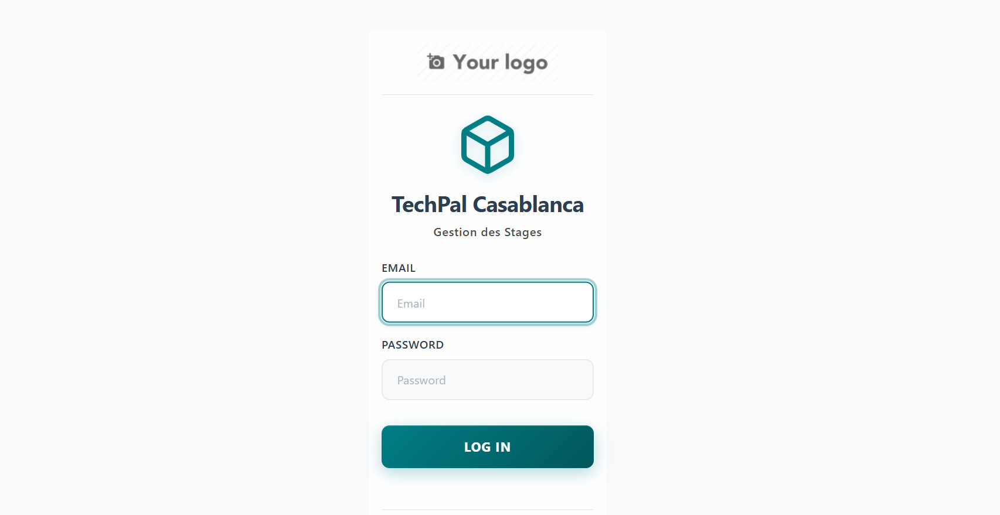
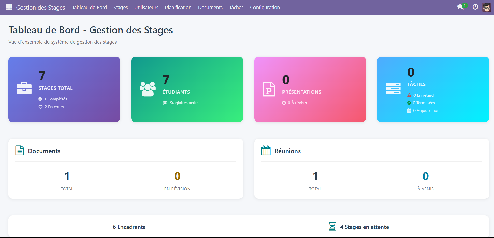
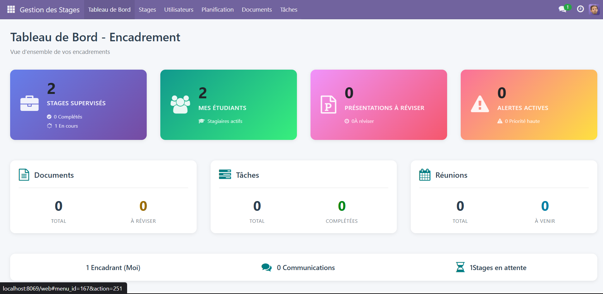
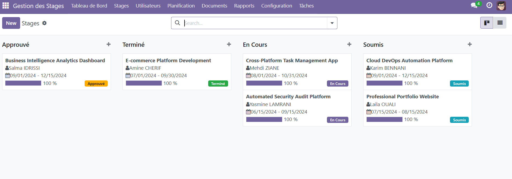
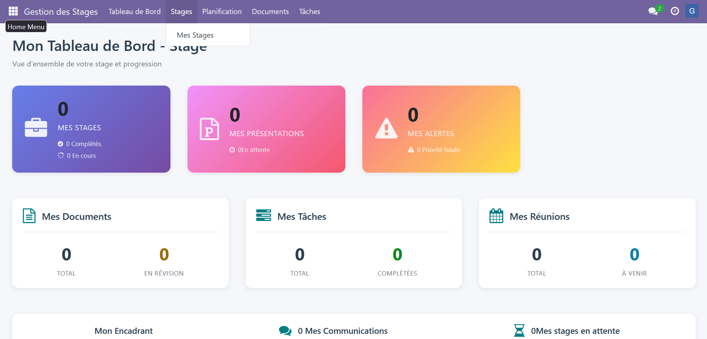

# 📖 Guide Utilisateur - Système de Gestion des Stages TechPal

**Version** : 2.0.0  
**Date** : Janvier 2025  
**Auteur** : SILUE - TechPal Casablanca

---

## 📋 Table des Matières

1. [Introduction](#1-introduction)
2. [Connexion et Interface](#2-connexion-et-interface)
3. [Rôles et Permissions](#3-rôles-et-permissions)
4. [Guide par Rôle](#4-guide-par-rôle)
   - [4.1 Administrateur](#41-administrateur)
   - [4.2 Coordinateur](#42-coordinateur)
   - [4.3 Encadrant](#43-encadrant)
   - [4.4 Stagiaire](#44-stagiaire)
5. [Fonctionnalités Communes](#5-fonctionnalités-communes)
6. [FAQ](#6-faq)
7. [Support](#7-support)

---

## 1. Introduction

### 1.1 À propos

Le **Système de Gestion des Stages TechPal** est une plateforme centralisée permettant de gérer l'intégralité du cycle de vie d'un stage, de la candidature à l'évaluation finale.

### 1.2 Objectifs

- Simplifier la gestion administrative des stages
- Faciliter la communication entre les acteurs
- Automatiser la génération de documents officiels
- Assurer un suivi transparent de la progression

### 1.3 Accès au système

**URL** : `http://localhost:8069` (ou URL fournie par l'administrateur)

**Navigateurs supportés** :
- Google Chrome (recommandé)
- Mozilla Firefox
- Microsoft Edge
- Safari

### 1.4 Prérequis : Messagerie (SMTP)

Certaines fonctionnalités (envoi d'emails d'invitation, notifications, réinitialisation de mot de passe) nécessitent une **configuration SMTP**. Si la messagerie n'est pas configurée, les notifications restent visibles dans l'application, mais les emails ne seront pas envoyés.

> **📝 Note** : Voir la configuration SMTP dans `INSTALLATION.md` (section Configuration) pour activer l'envoi d'emails.

---

## 2. Connexion et Interface

### 2.1 Première connexion

1. Ouvrir l'URL dans votre navigateur
2. Saisir votre **email** et **mot de passe**
3. Cliquer sur **"Connexion"**



> **💡 Note** : Vos identifiants vous sont fournis par l'administrateur.

> **⚠️ Attention** : Si vous ne voyez pas la page de connexion personnalisée TechPal, contactez l'administrateur pour vérifier la configuration du module `internship_theme`.

### 2.2 Changer son mot de passe

1. Cliquer sur votre **nom** en haut à droite
2. Sélectionner **"Mon profil"**
3. Cliquer sur **"Modifier"**
4. Saisir un nouveau mot de passe
5. Cliquer sur **"Enregistrer"**

### 2.3 Interface principale

```
┌─────────────────────────────────────────────┐
│  Logo    [Gestion des Stages]    [👤 Nom]  │
├─────────────────────────────────────────────┤
│  ┌──────────┐                               │
│  │ Menu     │  Contenu principal            │
│  │  Stages  │  (Dashboard, listes, etc.)    │
│  │  Docs    │                               │
│  │  Réunions│                               │
│  └──────────┘                               │
└─────────────────────────────────────────────┘
```

**Zones principales** :
- **Barre de menu** : Navigation entre modules
- **Zone de contenu** : Affichage des données
- **Menu utilisateur** : Profil, déconnexion

---

## 3. Rôles et Permissions

### 3.1 Les 4 rôles

| Rôle | Description | Droits principaux |
|------|-------------|-------------------|
| **Administrateur** | Gestion complète du système | Tous les droits |
| **Coordinateur** | Coordination des stages | Supervision globale |
| **Encadrant** | Suivi des stagiaires | Gestion de ses stages |
| **Stagiaire** | Étudiant en stage | Consultation et soumission |

### 3.2 Matrice des permissions

| Action | Admin | Coordinateur | Encadrant | Stagiaire |
|--------|-------|--------------|-----------|-----------|
| Créer un stage | ✅ | ✅ | ✅ | ❌ |
| Voir tous les stages | ✅ | ✅ | ❌ | ❌ |
| Voir ses stages | ✅ | ✅ | ✅ | ✅ |
| Valider un stage | ✅ | ✅ | ❌ | ❌ |
| Soumettre documents | ✅ | ✅ | ✅ | ✅ |
| Approuver documents | ✅ | ✅ | ✅ | ❌ |
| Créer utilisateurs | ✅ | ❌ | ❌ | ❌ |
| Planifier réunions | ✅ | ✅ | ✅ | ❌ |
| Créer tâches | ✅ | ✅ | ✅ | ❌ |
| Évaluer stages | ✅ | ✅ | ✅ | ❌ |
| Générer rapports PDF | ✅ | ✅ | ✅ | ❌ |

---

## 4. Guide par Rôle

## 4.1 Administrateur

### 4.1.1 Tableau de bord

**Menu** : `Gestion des Stages > Tableau de Bord`

Le dashboard administrateur affiche :
- **Statistiques globales** : Nombre total de stages, étudiants, encadrants
- **Répartition par statut** : Brouillon, En cours, Terminé, Évalué
- **Alertes** : Stages en retard, tâches non complétées
- **Activité récente** : Derniers stages créés/modifiés



> **📊 Note** : Le dashboard utilise le composant OWL personnalisé défini dans `static/src/dashboard/dashboard.js`

### 4.1.2 Gérer les utilisateurs

**Menu** : `Paramètres > Utilisateurs`

#### Créer un nouvel utilisateur

1. Cliquer sur **"Créer"**
2. Remplir les informations :
   - **Nom complet**
   - **Email** (sera l'identifiant de connexion)
   - **Rôle** : Sélectionner parmi Admin, Coordinateur, Encadrant, Stagiaire
3. Cliquer sur **"Enregistrer"**
4. Un email avec le mot de passe temporaire peut être envoyé automatiquement si la messagerie est configurée

#### Désactiver un utilisateur

1. Ouvrir la fiche utilisateur
2. Décocher **"Actif"**
3. Enregistrer

> **⚠️ Important** : Ne jamais supprimer un utilisateur, toujours le désactiver.

### 4.1.3 Configuration du système

**Menu** : `Paramètres > Configuration`

**Paramètres disponibles** :
- Durée par défaut des stages
- Modèles d'emails de notification
- Règles de validation automatique
- Paramètres de sécurité

---

## 4.2 Coordinateur

### 4.2.1 Tableau de bord

**Menu** : `Gestion des Stages > Tableau de Bord`

Le dashboard coordinateur affiche :
- Vue d'ensemble de tous les stages actifs
- Stages en attente de validation
- Statistiques par encadrant
- Taux de complétion global

### 4.2.2 Gérer les stages

#### Valider un stage

**Menu** : `Gestion des Stages > Stages > Tous les Stages`

1. Ouvrir le stage en statut **"Soumis"**
2. Vérifier les informations :
   - Titre du stage
   - Description du projet
   - Encadrant assigné
   - Dates de début/fin
3. Cliquer sur **"Approuver"** ou **"Rejeter"**
4. Si rejet, ajouter un commentaire explicatif dans le Chatter

#### Affecter un encadrant

1. Ouvrir la fiche du stage
2. Cliquer sur **"Modifier"**
3. Sélectionner l'encadrant dans le champ **"Encadrant(e)"**
4. Enregistrer

### 4.2.3 Rapports et statistiques

**Menu** : `Gestion des Stages > Rapports`

**Rapports disponibles** :
- **Performance par encadrant** : Nombre de stages, notes moyennes
- **Taux de réussite** : Statistiques de complétion
- **Analyse temporelle** : Évolution sur l'année

**Exporter un rapport** :
1. Ouvrir le rapport souhaité
2. Cliquer sur **"Imprimer"** ou **"Exporter"**
3. Choisir le format (PDF ou Excel)

---

## 4.3 Encadrant

### 4.3.1 Tableau de bord

**Menu** : `Gestion des Stages > Tableau de Bord`

Le dashboard encadrant affiche :
- Vos stages en cours
- Documents à réviser
- Prochaines réunions
- Tâches en retard



> **📊 Note** : Le dashboard s'adapte automatiquement selon votre rôle et vos permissions

### 4.3.2 Créer un stage

**Menu** : `Gestion des Stages > Stages Encadrés > Créer`

#### Étapes de création

**1. Informations de base**
Titre du stage : [Développement d'une plateforme web]
Type : [Stage d'été / PFE / Stage professionnel]
Domaine : [Développement logiciel]

**2. Sélection du stagiaire**
Étudiant(e) : [Sélectionner dans la liste]
Institution : [Automatiquement rempli]

**3. Dates**
Date de début : [01/07/2024]
Date de fin : [30/09/2024]
Durée : [Calculée automatiquement]

**4. Description du projet**
Description : [Saisir une description détaillée]
Objectifs pédagogiques : [Lister les objectifs]

**5. Compétences requises**
[Sélectionner les compétences] : Python, JavaScript, etc.

**6. Enregistrer**
- Cliquer sur **"Enregistrer"** (statut = Brouillon)
- Cliquer sur **"Soumettre"** pour validation coordinateur

### 4.3.3 Suivre un stage

#### Vue Kanban

**Menu** : `Gestion des Stages > Stages Encadrés`

La vue Kanban organise les stages par statut :



**Glisser-déposer** une carte pour changer son statut.

#### Ajouter une tâche

1. Ouvrir le stage
2. Onglet **"Tâches et Livrables"**
3. Cliquer sur **"Créer Tâche"**
4. Remplir :
   - **Nom de la tâche**
   - **Description**
   - **Date limite**
   - **Priorité**
5. Enregistrer

La tâche est automatiquement assignée au stagiaire.

### 4.3.4 Réviser des documents

**Menu** : `Documents > Documents à Réviser`

#### Processus de révision

1. Ouvrir le document en statut **"Soumis pour Révision"**
2. Télécharger et examiner le fichier
3. Deux options :

**Option A : Approuver**

Cliquer sur "Approuver"
Ajouter un commentaire positif dans le Chatter (optionnel)
Le statut passe à "Approuvé"


**Option B : Demander des modifications**

Cliquer sur "Demander une Révision"
OBLIGATOIRE : Poster un commentaire détaillé dans le Chatter

Expliquer ce qui ne va pas
Donner des conseils d'amélioration


Le statut passe à "Rejeté"
Le stagiaire reçoit une notification


> **💡 Bonne pratique** : Toujours utiliser le Chatter pour expliquer vos décisions.

### 4.3.5 Planifier une réunion

**Menu** : `Planification > Réunions > Créer`

1. **Informations générales**
   - Titre : Ex. "Réunion de suivi hebdomadaire"
   - Type : Suivi / Milestone / Soutenance
   - Stage associé
   
2. **Date et heure**
   - Date : [Sélectionner]
   - Durée : [1.0 heures]
   
3. **Modalité**
   - En présentiel : Remplir le champ "Lieu"
   - En ligne : Remplir le champ "URL" (Zoom, Teams, etc.)
   
4. **Participants**
   - Stagiaire (ajouté automatiquement)
   - Autres participants (optionnel)
   
5. **Ordre du jour**
   - Saisir les points à discuter
   
6. **Planifier**
   - Cliquer sur **"Planifier & Envoyer l'Invitation"**
   - Les participants reçoivent un email automatiquement si la messagerie est configurée

#### Après la réunion

1. Ouvrir la réunion
2. Onglet **"Compte-Rendu"**
3. Rédiger le compte-rendu
4. Cliquer sur **"Marquer comme Terminée"**

### 4.3.6 Évaluer un stage

**Prérequis** : Le stage doit être en statut **"Terminé"**.

#### Étapes d'évaluation

1. Ouvrir le stage
2. Onglet **"Soutenance & Évaluation"**
3. Remplir :
   - **Date de soutenance**
   - **Lieu de soutenance**
   - **Membres du jury**
   - **Note de soutenance** (sur 20)
   - **Note finale** (sur 20)
   - **Feedback d'évaluation** (commentaires détaillés)
4. Cliquer sur **"Évaluer"**

Le statut passe à **"Évalué"** et les documents officiels peuvent être générés.

---

## 4.4 Stagiaire

### 4.4.1 Tableau de bord

**Menu** : `Gestion des Stages > Tableau de Bord`

Le dashboard stagiaire affiche :
- **Mon stage en cours** : Titre, progression, dates
- **Mes tâches** : À faire, en cours, terminées
- **Mes documents** : Statut des documents soumis
- **Prochaines réunions** : Calendrier des réunions



> **📊 Note** : Le dashboard stagiaire se concentre sur vos informations personnelles et votre progression

### 4.4.2 Consulter mon stage

**Menu** : `Gestion des Stages > Mes Stages`

**Informations visibles** :
- Description du projet
- Objectifs pédagogiques
- Encadrant assigné
- Dates de début/fin
- Progression globale (%)

### 4.4.3 Gérer mes tâches

**Menu** : `Tâches > Mes Tâches`

#### Marquer une tâche comme "En cours"

1. Ouvrir la tâche en statut **"À Faire"**
2. Cliquer sur **"Démarrer"**
3. Le statut passe à **"En Cours"**

#### Mettre à jour la progression

1. Ouvrir la tâche
2. Modifier le champ **"Progression (%)"**
3. Enregistrer

#### Marquer une tâche comme "Terminée"

1. Ouvrir la tâche en statut **"En Cours"**
2. Cliquer sur **"Terminer"**
3. Le statut passe à **"Terminée"**
4. L'encadrant reçoit une notification (et un email si la messagerie est configurée)

> **⚠️ Attention** : Respectez les dates limites pour éviter les alertes.

### 4.4.4 Soumettre des documents

**Menu** : `Documents > Mes Documents > Créer`

#### Téléverser un document

**1. Informations du document**
Titre : [Rapport de mi-stage]
Type : [Rapport d'avancement]
Stage : [Automatiquement sélectionné]

**2. Upload du fichier**

Cliquer sur "Parcourir"
Sélectionner le fichier (PDF, Word, PPT acceptés)
Max 50 MB


**3. Description (optionnel)**
Ajouter des informations sur le contenu du document

**4. Soumettre**

Cliquer sur "Enregistrer" (brouillon)
Cliquer sur "Soumettre pour Révision"


#### Suivre le statut d'un document

**Menu** : `Documents > Mes Documents`

**Statuts possibles** :
- 🟦 **Brouillon** : Non encore soumis
- 🟡 **Soumis** : En attente de révision
- 🟠 **En Révision** : L'encadrant examine
- 🟢 **Approuvé** : Document validé
- 🔴 **Rejeté** : Modifications demandées

> **💡 Conseil** : Consultez le Chatter pour voir les commentaires de l'encadrant.

#### Soumettre une nouvelle version

Si votre document est **"Rejeté"** :

1. Lire les commentaires de l'encadrant dans le Chatter
2. Modifier votre document selon les remarques
3. Retourner sur la fiche du document
4. **Modifier** le champ "Version" (ex: 1.0 → 1.1)
5. **Remplacer** le fichier
6. **Re-soumettre pour Révision**

### 4.4.5 Déposer ma présentation

**Menu** : `Documents > Mes Présentations > Créer`

#### Soumettre une présentation de soutenance

**1. Informations**
Titre : [Présentation finale - Projet X]
Stage : [Automatiquement sélectionné]
Version : [1.0]

**2. Upload**
Fichier : [Sélectionner PowerPoint ou PDF]
Taille max : 50 MB

**3. Date limite (si définie par l'encadrant)**
Affichée automatiquement

**4. Soumettre**
Cliquer sur "Soumettre pour Révision"

#### Processus de validation

Soumission → Statut "Soumis"
L'encadrant examine
3a. Approuvé → Statut "Approuvé" ✅
3b. Révision requise → Statut "En Révision" ⚠️
Si révision : Corriger et re-soumettre


---

## 5. Fonctionnalités Communes

### 5.1 Le Chatter (Messagerie)

Le **Chatter** est présent sur toutes les fiches (stages, documents, réunions, etc.).

#### Envoyer un message

1. Descendre en bas de la fiche
2. Zone "Envoyer un message"
3. Saisir votre message
4. Cliquer sur "Envoyer"

**Le message est visible par** :
- Les abonnés à la fiche
- Les personnes mentionnées avec @

#### Mentionner quelqu'un

1. Taper `@` puis commencer à écrire le nom
2. Exemple : `@Youssef KADIRI pouvez-vous réviser le document ?`
3. La personne mentionnée reçoit une notification

#### S'abonner à une fiche

1. Cliquer sur "Suivre" en haut à droite
2. Vous recevrez toutes les notifications de cette fiche


### 5.2 Les Activités (To-Do)

Les **Activités** sont des tâches/rappels associés à une fiche.

#### Créer une activité

1. Sur une fiche, cliquer sur l'icône horloge 🕒
2. Remplir :
   - **Type** : Appel, Email, À faire, Réunion
   - **Résumé** : Titre de l'activité
   - **Date d'échéance**
   - **Assigné à** : Utilisateur responsable
3. Cliquer sur **"Planifier"**

#### Marquer une activité comme terminée

1. Ouvrir l'activité (icône horloge)
2. Cliquer sur **"Marquer comme fait"**
3. Ajouter un commentaire (optionnel)


### 5.3 Générer des rapports PDF

**Disponible pour les encadrants et coordinateurs.**

**Menu** : `Sur une fiche de stage > Imprimer`

**Rapports disponibles** :
- **Convention de stage** : Document officiel
- **Attestation de stage** : Certificat de fin de stage
- **Procès-verbal de soutenance** : PV officiel
- **Rapport d'évaluation** : Notes et feedback
- **Rapport de synthèse** : Vue d'ensemble du stage

**Processus** :

1. Ouvrir le stage
2. Onglet **"Rapports"**
3. Cliquer sur le rapport souhaité
4. Le PDF se génère automatiquement
5. Télécharger ou imprimer


### 5.4 Exporter des données

**Format d'export** : Excel (.xlsx)

**Depuis une liste** :

1. Afficher la liste (ex: liste des stages)
2. Cliquer sur l'icône "télécharger" (en haut à droite)
3. Sélectionner les champs à exporter
4. Cliquer sur **"Exporter"**


---

## 6. FAQ (Foire Aux Questions)

### Q1 : J'ai oublié mon mot de passe, que faire ?

**R** : Sur la page de connexion, cliquer sur **"Mot de passe oublié ?"** et suivre les instructions. Un email de réinitialisation sera envoyé.

### Q2 : Comment savoir si mon document a été lu ?

**R** : Vous recevrez une notification dans l'application, et par email si la messagerie est configurée, dès que l'encadrant change le statut du document.

### Q3 : Puis-je supprimer un document ?

**R** : Non, vous ne pouvez pas supprimer un document après soumission. Vous pouvez le marquer comme "Archivé" si nécessaire.

### Q4 : Comment changer l'encadrant d'un stage ?

**R** : Seuls les coordinateurs et administrateurs peuvent modifier l'encadrant. Contactez-les via le Chatter sur la fiche du stage.

### Q5 : Puis-je créer plusieurs stages pour un même étudiant ?

**R** : Oui, un étudiant peut avoir plusieurs stages (ex: stage d'été puis PFE).

### Q6 : Les notifications par email fonctionnent-elles automatiquement ?

**R** : Les notifications sont créées automatiquement dans l'application pour :
- Nouveau stage créé
- Document soumis/approuvé/rejeté
- Réunion planifiée
- Tâche assignée
- Mention dans le Chatter

> **📧 Note** : L'envoi par email nécessite une configuration SMTP. Voir la section 1.4 pour plus de détails.

### Q7 : Comment voir l'historique des modifications ?

**R** : Sur chaque fiche, descendre jusqu'au Chatter. Tous les changements sont tracés.

### Q8 : Puis-je personnaliser mon tableau de bord ?

**R** : Le tableau de bord est automatiquement personnalisé selon votre rôle et ne peut pas être modifié manuellement.

---

## 7. Support

### 7.1 Contacts

**Support technique** :
- 📧 Email : support@techpal.ma
- 📞 Téléphone : +212 522 XX XX XX
- ⏰ Horaires : Lundi-Vendredi, 9h-18h

**Coordinateur des stages** :
- 👤 Nom : [À définir par l'organisation]
- 📧 Email : coordinator@techpal.ma

**Développeur du système** :
- 👤 Nom : SILUE
- 📧 Email : silue@techpal.ma
- 🐙 GitHub : [https://github.com/Gninho-silue/internship_management](https://github.com/Gninho-silue/internship_management)

### 7.2 Signaler un bug

**Via l'application** :

1. Menu utilisateur (en haut à droite)
2. **"Signaler un problème"**
3. Décrire le bug avec captures d'écran
4. **Envoyer**

**Par email** :
- **À** : support@techpal.ma
- **Objet** : `[BUG] Description courte`
- **Corps** :
  - Description détaillée
  - Étapes pour reproduire
  - Captures d'écran
  - Navigateur utilisé


### 7.3 Demander une formation

Pour une formation personnalisée ou en groupe :
- 📧 Email : formation@techpal.ma
- **Durée** : 2h par session
- **Format** : Présentiel ou Zoom
- **Contenu** : Adaptation selon le rôle (Admin, Encadrant, Stagiaire)

---

## 📝 Notes de version

### Version 2.0.0 (Janvier 2025)
- **Restructuration complète** du guide utilisateur
- **Corrections des informations** pour correspondre au système réel
- **Suppression des références** aux images inexistantes
- **Amélioration du formatage** et de la structure
- **Validation technique** avec le code source réel
- **FAQ mise à jour** avec les bonnes informations

### Version 1.0.0 (Octobre 2024)
- Version initiale du guide utilisateur
- Couverture complète des 4 rôles
- FAQ complète

---

**© 2024-2025 TechPal Casablanca - Tous droits réservés**  
**Développé par SILUE dans le cadre d'un stage d'été**