# 📖 Guide Utilisateur - Système de Gestion des Stages TechPal

**Version** : 1.0.0  
**Date** : Octobre 2025  
**Auteur** : SILUE - TechPal Casablanca

---

## 📋 Table des Matières

1. [Introduction](#1-introduction)
2. [Connexion et Interface](#2-connexion-et-interface)
3. [Rôles et Permissions](#3-rôles-et-permissions)
4. [Guide par Rôle](#4-guide-par-rôle)
   - [4.1 Administrateur](#41-administrateur)
   - [4.2 Coordinateur](#42-coordinateur)
   - [4.3 Encadrant](#43-encadrant)
   - [4.4 Stagiaire](#44-stagiaire)
5. [Fonctionnalités Communes](#5-fonctionnalités-communes)
6. [FAQ](#6-faq)
7. [Support](#7-support)

---

## 1. Introduction

### 1.1 À propos

Le **Système de Gestion des Stages TechPal** est une plateforme centralisée permettant de gérer l'intégralité du cycle de vie d'un stage, de la candidature à l'évaluation finale.

### 1.2 Objectifs

- Simplifier la gestion administrative des stages
- Faciliter la communication entre les acteurs
- Automatiser la génération de documents officiels
- Assurer un suivi transparent de la progression

### 1.3 Accès au système

**URL** : `http://localhost:8069` (ou URL fournie par l'administrateur)

**Navigateurs supportés** :
- Google Chrome (recommandé)
- Mozilla Firefox
- Microsoft Edge
- Safari

### 1.4 Prérequis : Messagerie (SMTP)

Certaines fonctionnalités (envoi d'emails d'invitation, notifications, réinitialisation de mot de passe) nécessitent une **configuration SMTP**. Si la messagerie n'est pas configurée, les notifications restent visibles dans l'application, mais les emails ne seront pas envoyés.

> **📝 Note** : Voir la configuration SMTP dans `INSTALLATION.md` (section Configuration) pour activer l'envoi d'emails.

---

## 2. Connexion et Interface

### 2.1 Première connexion

1. Ouvrir l'URL dans votre navigateur
2. Saisir votre **email** et **mot de passe**
3. Cliquer sur **"Connexion"**


> **💡 Note** : Vos identifiants vous sont fournis par l'administrateur.

> **⚠️ Attention** : Si vous ne voyez pas la page de connexion personnalisée TechPal, contactez l'administrateur pour vérifier la configuration du module `internship_theme`.

### 2.2 Changer son mot de passe

1. Cliquer sur votre **nom** en haut à droite
2. Sélectionner **"Mon profil"**
3. Cliquer sur **"Modifier"**
4. Saisir un nouveau mot de passe
5. Cliquer sur **"Enregistrer"**

### 2.3 Interface principale

```
┌─────────────────────────────────────────────┐
│  Logo    [Gestion des Stages]    [👤 Nom]  │
├─────────────────────────────────────────────┤
│  ┌──────────┐                               │
│  │ Menu     │  Contenu principal            │
│  │  Stages  │  (Dashboard, listes, etc.)    │
│  │  Docs    │                               │
│  │  Réunions│                               │
│  └──────────┘                               │
└─────────────────────────────────────────────┘
```

**Zones principales** :
- **Barre de menu** : Navigation entre modules
- **Zone de contenu** : Affichage des données
- **Menu utilisateur** : Profil, déconnexion

---

## 3. Rôles et Permissions

### 3.1 Les 4 rôles

| Rôle | Description | Droits principaux |
|------|-------------|-------------------|
| **Administrateur** | Gestion complète du système | Tous les droits |
| **Coordinateur** | Coordination des stages | Supervision globale |
| **Encadrant** | Suivi des stagiaires | Gestion de ses stages |
| **Stagiaire** | Étudiant en stage | Consultation et soumission |

### 3.2 Matrice des permissions

| Action | Admin | Coordinateur | Encadrant | Stagiaire |
|--------|-------|--------------|-----------|-----------|
| Créer un stage | ✅ | ✅ | ❌ | ❌ |
| Voir tous les stages | ✅ | ✅ | ❌ | ❌ |
| Voir ses stages | ✅ | ✅ | ✅ | ✅ |
| Valider un stage | ✅ | ✅ | ❌ | ❌ |
| Soumettre documents | ✅ | ✅ | ✅ | ✅ |
| Approuver documents | ✅ | ✅ | ✅ | ❌ |
| Créer utilisateurs | ✅ | ❌ | ❌ | ❌ |
| Planifier réunions | ✅ | ✅ | ✅ | ❌ |
| Créer tâches | ✅ | ✅ | ✅ | ✅ |
| Évaluer stages | ✅ | ✅ | ✅ | ❌ |
| Générer rapports PDF | ✅ | ✅ | ✅ | ✅ |

### 3.3 Actions par menu et par rôle

Ces matrices détaillent ce que chaque rôle peut faire dans les menus visibles (basé sur la configuration des menus et groupes).

#### Stages
| Menu/Vue | Admin | Coordinateur | Encadrant | Stagiaire |
|----------|-------|--------------|-----------|-----------|
| Tableau de Bord | ✅ | ✅ | ✅ | ✅ |
| Tous les Stages | ✅ (voir/créer/éditer) | ✅ (voir/créer/éditer) | ❌ | ❌ |
| Stages Encadrés | ❌ | ❌ | ✅ (voir/éditer) | ❌ |
| Mes Stages | ❌ | ❌ | ❌ | ✅ (voir) |

#### Utilisateurs
| Menu/Vue | Admin | Coordinateur | Encadrant | Stagiaire |
|----------|-------|--------------|-----------|-----------|
| Étudiants | ✅ (voir/créer/éditer) | ✅ (voir/créer/éditer) | ✅ (voir) | ❌ |
| Encadrants | ✅ (voir/créer/éditer) | ✅ (voir/créer/éditer) | ❌ | ❌ |

#### Planification (Réunions)
| Menu/Vue | Admin | Coordinateur | Encadrant | Stagiaire |
|----------|-------|--------------|-----------|-----------|
| Toutes les Réunions | ✅ | ✅ | ❌ | ❌ |
| Réunions (mes réunions) | ❌ | ❌ | ✅ | ✅ |

#### Documents
| Menu/Vue | Admin | Coordinateur | Encadrant | Stagiaire |
|----------|-------|--------------|-----------|-----------|
| Tous les Documents | ✅ | ✅ | ❌ | ❌ |
| Mes Documents (encadrant) | ❌ | ❌ | ✅ | ❌ |
| Documents à Réviser | ❌ | ❌ | ✅ | ❌ |
| Mes Documents (stagiaire) | ❌ | ❌ | ❌ | ✅ |

#### Présentations
| Menu/Vue | Admin | Coordinateur | Encadrant | Stagiaire |
|----------|-------|--------------|-----------|-----------|
| Toutes les Présentations | ✅ | ✅ | ❌ | ❌ |
| Présentations à Réviser | ❌ | ❌ | ✅ | ❌ |
| Mes Présentations | ❌ | ❌ | ❌ | ✅ |

#### Commentaires (Feedback)
| Menu/Vue | Admin | Coordinateur | Encadrant | Stagiaire |
|----------|-------|--------------|-----------|-----------|
| Tous les Commentaires | ✅ | ✅ | ❌ | ❌ |
| Mes Commentaires (encadrant) | ❌ | ❌ | ✅ | ❌ |
| Mes Commentaires (stagiaire) | ❌ | ❌ | ❌ | ✅ |

#### Tâches
| Menu/Vue | Admin | Coordinateur | Encadrant | Stagiaire |
|----------|-------|--------------|-----------|-----------|
| Toutes les Tâches | ✅ | ✅ | ❌ | ❌ |
| Mes Tâches | ❌ | ❌ | ✅ | ✅ |
| Tâches en Retard (encadrant) | ❌ | ❌ | ✅ | ❌ |
| Tâches Échues Aujourd'hui (encadrant) | ❌ | ❌ | ✅ | ❌ |

#### Configuration
| Menu/Vue | Admin | Coordinateur | Encadrant | Stagiaire |
|----------|-------|--------------|-----------|-----------|
| Compétences | ✅ (voir/créer/éditer) | ✅ (voir/créer/éditer) | ❌ | ❌ |
| Domaines d'Expertise | ✅ (voir/créer/éditer) | ✅ (voir/créer/éditer) | ❌ | ❌ |
| Paramètres de Sécurité | ✅ | ❌ | ❌ | ❌ |

---

## 4. Guide par Rôle

## 4.1 Administrateur

### 4.1.1 Tableau de bord

**Menu** : `Gestion des Stages > Tableau de Bord`

Le dashboard administrateur affiche :
- **Statistiques globales** : Nombre total de stages, étudiants, encadrants
- **Répartition par statut** : Brouillon, En cours, Terminé, Évalué
- **Alertes** : Stages en retard, tâches non complétées
- **Activité récente** : Derniers stages créés/modifiés


> **📊 Note** : Le dashboard utilise le composant OWL personnalisé défini dans `static/src/dashboard/dashboard.js`

#### Exemples de vues clés
- Liste des stages (tous les stages) — vue Liste et Kanban
  
  
   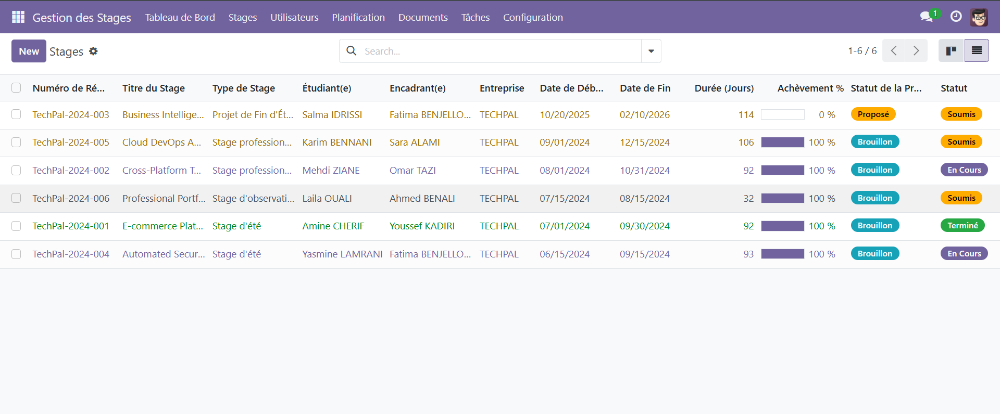

- Création d'un stage
  
  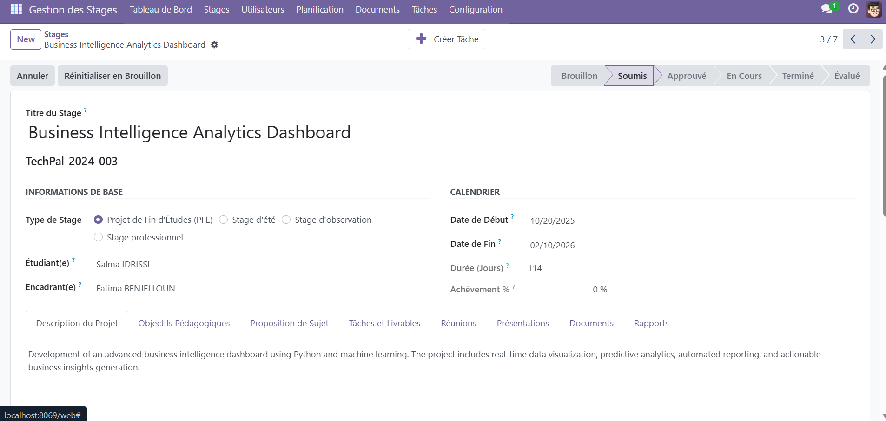

### 4.1.2 Gérer les utilisateurs

**Menu** : `Paramètres > Utilisateurs`

#### Créer un nouvel utilisateur

1. Cliquer sur **"Créer"**
2. Remplir les informations :
   - **Nom complet**
   - **Email** (sera l'identifiant de connexion)
   - **Rôle** : Sélectionner parmi Admin, Coordinateur, Encadrant, Stagiaire
3. Cliquer sur **"Enregistrer"**
4. Un email avec le mot de passe temporaire peut être envoyé automatiquement si la messagerie est configurée

#### Désactiver un utilisateur

1. Ouvrir la fiche utilisateur
2. Décocher **"Actif"**
3. Enregistrer

> **⚠️ Important** : Ne jamais supprimer un utilisateur, toujours le désactiver.


#### Créer un nouvel stagiaire ou un encore Encrandrant

**Menu** : `Gestion des Stages >Utilisateur > Etudiants > Créer`
Renseigner les information du stagiaire puis sauvegarder
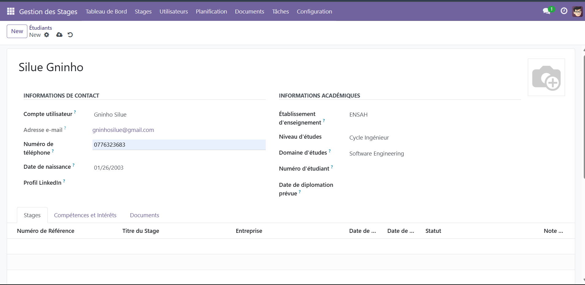

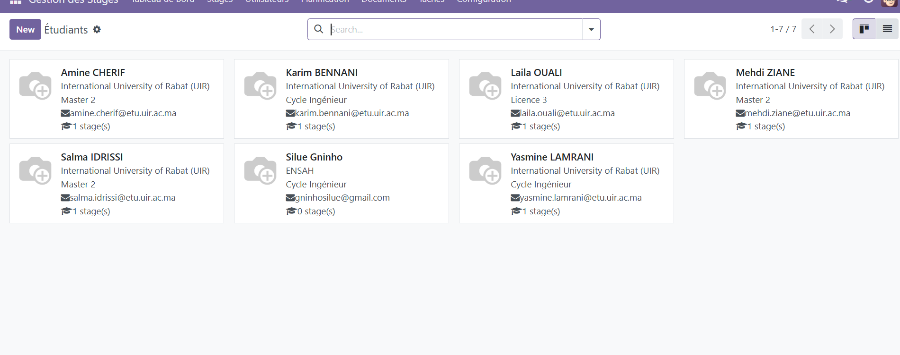

De meme pour un  encadrant:
**Menu** : `Gestion des Stages >Utilisateur > Encadrants > Créer`
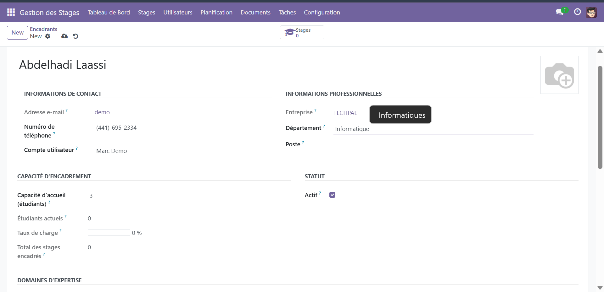

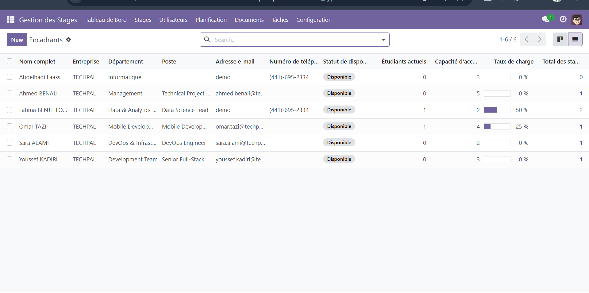

### 4.1.3 Configuration du système

**Menu** : `Paramètres > Configuration`

**Paramètres disponibles** :
- Competences des stagiares
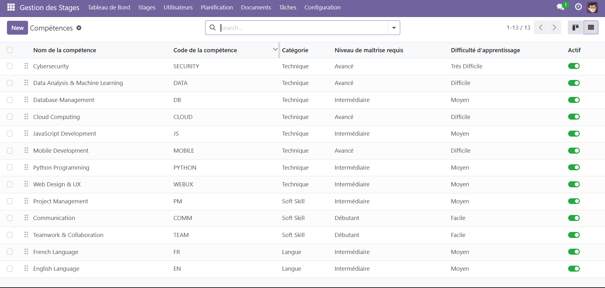
- Les domaines d'expertise des encadrants ou  des stages

- Paramètres de sécurité


### 4.1.4 Créer un stage

**Menu** : `Gestion des Stages >Tous les Stages  > Créer` 


#### Étapes de création

**1. Informations de base**  
Titre du stage : [Développement d'une plateforme web]  
Type : [Stage d'été / PFE / Stage professionnel]  
Domaine : [Développement logiciel]  

**2. Sélection du stagiaire et de l'encadrant**  
Étudiant(e) : [Sélectionner dans la liste]  
Encadrant : [Sélectionner dans la liste]  

**3. Dates**  
Date de début : [01/07/2024]  
Date de fin : [30/09/2024]  
Durée : [Calculée automatiquement]

**4. Description du projet**  
Description : [Saisir une description détaillée]  
Objectifs pédagogiques : [Lister les objectifs]  
Proposition de Sujet: Rediger un propose du sujet et envoyer. Le stagiare recevra un message dans le chatter.Puis
il peut accepter ou demander des modification

**5. Compétences requises**  
[Sélectionner les compétences] : Python, JavaScript, etc.

**6. Enregistrer**  
- Cliquer sur **"Enregistrer"** (statut = Brouillon)  
- Cliquer sur **"Soumettre"** pour lors que le stagiare accpete la proposition.


---

## 4.2 Coordinateur

### 4.2.1 Tableau de bord

**Menu** : `Gestion des Stages > Tableau de Bord`

Le dashboard coordinateur affiche :
- Vue d'ensemble de tous les stages actifs
- Stages en attente de validation
- Statistiques par encadrant
- Taux de complétion global

#### Actions typiques (scénario rapide)
1. Ouvrir Tous les Stages > filtrer sur « Soumis »
2. Ouvrir un stage > vérifier les informations > Approuver/Rejeter
3. Affecter un encadrant si nécessaire

### 4.2.2 Gérer les stages

#### Valider un stage

**Menu** : `Gestion des Stages > Stages > Tous les Stages`

1. Ouvrir le stage en statut **"Soumis"**
2. Vérifier les informations :
   - Titre du stage
   - Description du projet
   - Encadrant assigné
   - Dates de début/fin
3. Cliquer sur **"Approuver"** ou **"Rejeter"**
4. Si rejet, ajouter un commentaire explicatif dans le Chatter

#### Affecter un encadrant

1. Ouvrir la fiche du stage
2. Cliquer sur **"Modifier"**
3. Sélectionner l'encadrant dans le champ **"Encadrant(e)"**
4. Enregistrer

### 4.2.3 Rapports et statistiques

**Menu** : `Gestion des Stages > Rapports`

**Rapports disponibles** :
- **Performance par encadrant** : Nombre de stages, notes moyennes
- **Taux de réussite** : Statistiques de complétion
- **Analyse temporelle** : Évolution sur l'année

**Exporter un rapport** :
1. Ouvrir le rapport souhaité
2. Cliquer sur **"Imprimer"** ou **"Exporter"**
3. Choisir le format (PDF ou Excel)

---

## 4.3 Encadrant

### 4.3.1 Tableau de bord

**Menu** : `Gestion des Stages > Tableau de Bord`

Le dashboard encadrant affiche :
- Vos stages en cours
- Documents à réviser
- Prochaines réunions
- Tâches en retard

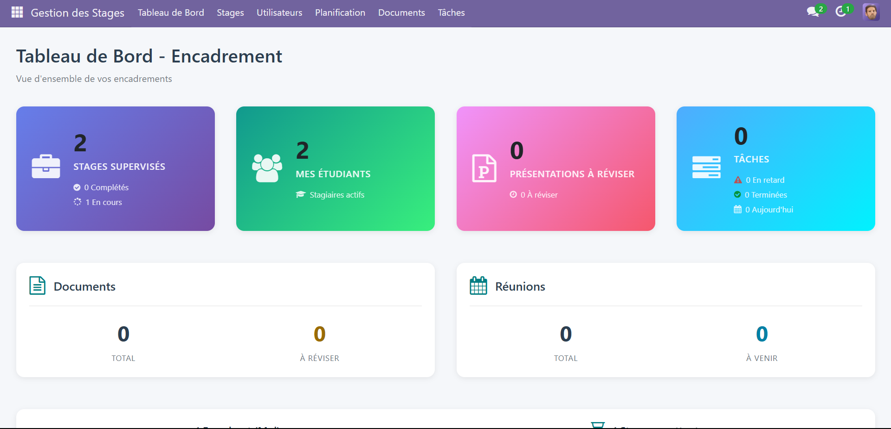

> **📊 Note** : Le dashboard s'adapte automatiquement selon votre rôle et vos permissions

### 4.3.3 Suivre un stage

#### Vue Kanban

**Menu** : `Gestion des Stages > Stages Encadrés`

La vue Kanban organise les stages par statut :


**Glisser-déposer** une carte pour changer son statut.

#### Actions typiques (scénario rapide)
1. Créer des tâches pour le stagiaire (onglet Tâches et Livrables)
2. Planifier les réunions de suivi
3. Réviser les documents soumis et poster du feedback
4. Évaluer le stage en fin de cycle

#### Ajouter une tâche

1. Ouvrir le stage
2. Onglet **"Tâches et Livrables"**
3. Cliquer sur **"Créer Tâche"**
4. Remplir :
   - **Nom de la tâche**
   - **Description**
   - **Date limite**
   - **Priorité**

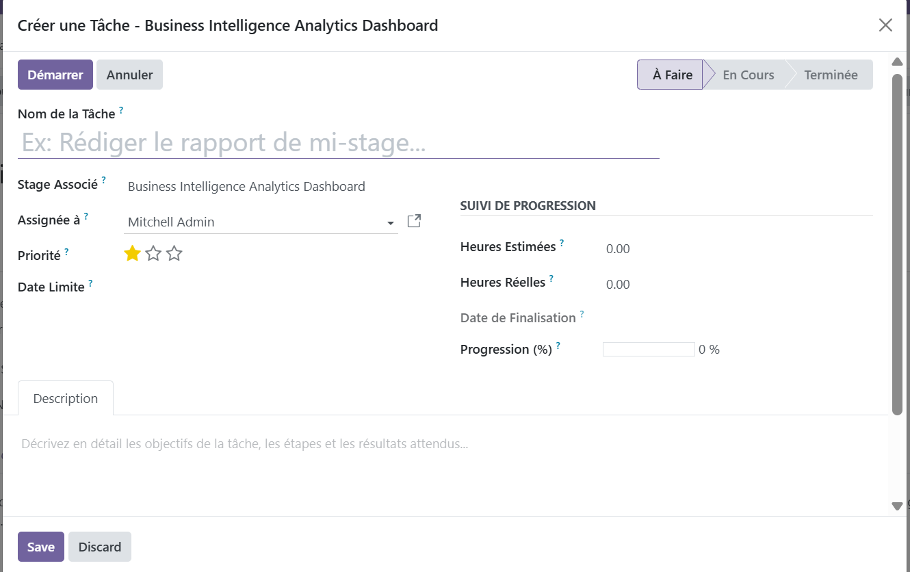
5. Enregistrer

La tâche est automatiquement assignée au stagiaire.

### 4.3.4 Réviser des documents

**Menu** : `Documents > Documents à Réviser`

#### Processus de révision

1. Ouvrir le document en statut **"Soumis pour Révision"**
2. Télécharger et examiner le fichier
3. Deux options :

**Option A : Approuver**

Cliquer sur "Approuver"
Ajouter un commentaire positif dans le Chatter (optionnel)
Le statut passe à "Approuvé"
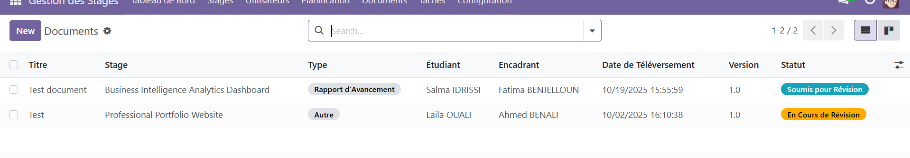


**Option B : Demander des modifications**

Cliquer sur "Demander une Révision"
OBLIGATOIRE : Poster un commentaire détaillé dans le Chatter

Expliquer ce qui ne va pas
Donner des conseils d'amélioration


Le statut passe à "Rejeté"
Le stagiaire reçoit une notification


> **💡 Bonne pratique** : Toujours utiliser le Chatter pour expliquer vos décisions.

### 4.3.5 Planifier une réunion

**Menu** : `Planification > Réunions > Créer`

1. **Informations générales**
   - Titre : Ex. "Réunion de suivi hebdomadaire"
   - Type : Suivi / Milestone / Soutenance
   - Stage associé
   
2. **Date et heure**
   - Date : [Sélectionner]
   - Durée : [1.0 heures]
   
3. **Modalité**
   - En présentiel : Remplir le champ "Lieu"
   - En ligne : Remplir le champ "URL" (Zoom, Teams, etc.)
   
4. **Participants**
   - Stagiaire (ajouté automatiquement)
   - Autres participants (optionnel)
   
5. **Ordre du jour**
   - Saisir les points à discuter
   
6. **Planifier**
   - Cliquer sur **"Planifier & Envoyer l'Invitation"**
   - Les participants reçoivent un email automatiquement si la messagerie est configurée

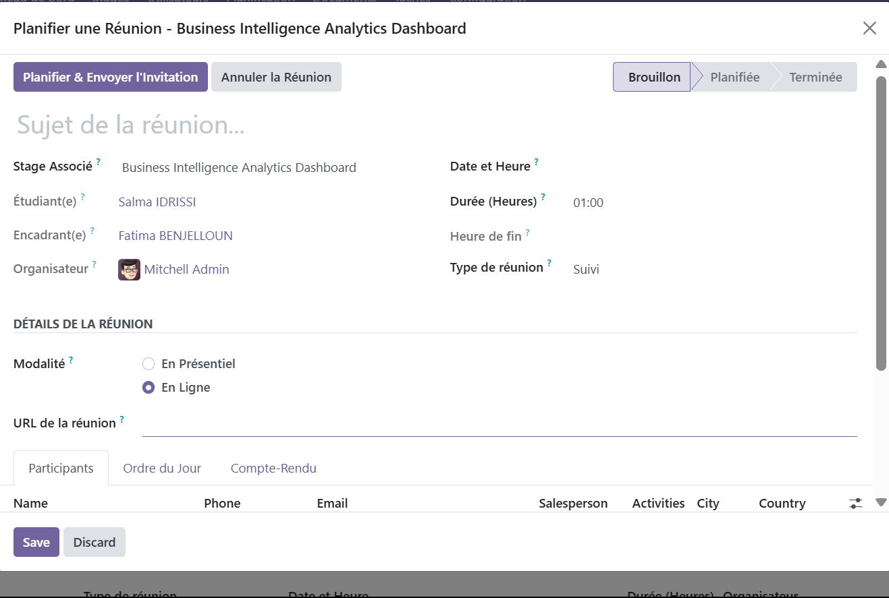

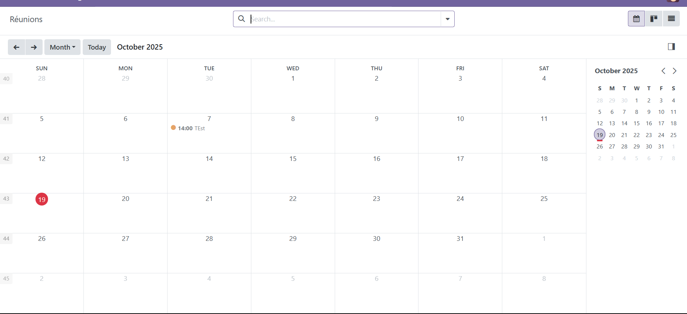

#### Après la réunion


1. Ouvrir la réunion
2. Onglet **"Compte-Rendu"**
3. Rédiger le compte-rendu
4. Cliquer sur **"Marquer comme Terminée"**

### 4.3.6 Évaluer un stage

**Prérequis** : Le stage doit être en statut **"Terminé"**.

#### Étapes d'évaluation

1. Ouvrir le stage
2. Onglet **"Soutenance & Évaluation"**
3. Remplir :
   - **Date de soutenance**
   - **Lieu de soutenance**
   - **Membres du jury**
   - **Note de soutenance** (sur 20)
   - **Note finale** (sur 20)
   - **Feedback d'évaluation** (commentaires détaillés)
4. Cliquer sur **"Évaluer"**

Le statut passe à **"Évalué"** et les documents officiels peuvent être générés.

---

## 4.4 Stagiaire

### 4.4.1 Tableau de bord

**Menu** : `Gestion des Stages > Tableau de Bord`

Le dashboard stagiaire affiche :
- **Mon stage en cours** : Titre, progression, dates
- **Mes tâches** : À faire, en cours, terminées
- **Mes documents** : Statut des documents soumis
- **Prochaines réunions** : Calendrier des réunions

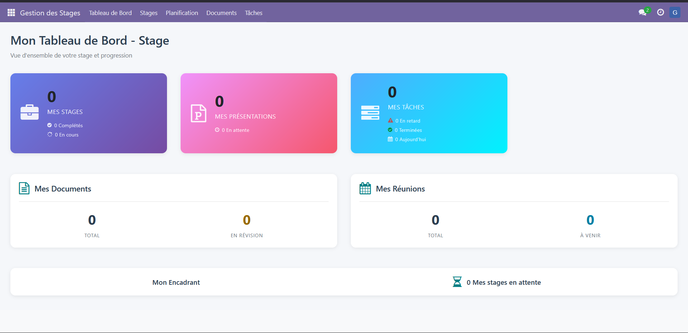

> **📊 Note** : Le dashboard stagiaire se concentre sur vos informations personnelles et votre progression

#### Actions typiques (scénario rapide)
1. Consulter « Mes Stages » et vérifier la progression
2. Gérer « Mes Tâches » (Démarrer, mettre à jour, Terminer)
3. Déposer mes documents et suivre le statut
4. Déposer ma présentation de soutenance

### 4.4.2 Consulter mon stage

**Menu** : `Gestion des Stages > Mes Stages`

**Informations visibles** :
- Description du projet
- Objectifs pédagogiques
- Encadrant assigné
- Dates de début/fin
- Progression globale (%)

### 4.4.3 Gérer mes tâches

**Menu** : `Tâches > Mes Tâches`

#### Marquer une tâche comme "En cours"

1. Ouvrir la tâche en statut **"À Faire"**
2. Cliquer sur **"Démarrer"**
3. Le statut passe à **"En Cours"**

#### Mettre à jour la progression

1. Ouvrir la tâche
2. Modifier le champ **"Progression (%)"**
3. Enregistrer

#### Marquer une tâche comme "Terminée"

1. Ouvrir la tâche en statut **"En Cours"**
2. Cliquer sur **"Terminer"**
3. Le statut passe à **"Terminée"**
4. L'encadrant reçoit une notification (et un email si la messagerie est configurée)

> **⚠️ Attention** : Respectez les dates limites pour éviter les alertes.

### 4.4.4 Soumettre des documents

**Menu** : `Documents > Mes Documents > Créer`

#### Téléverser un document

**1. Informations du document**
Titre : [Rapport de mi-stage]
Type : [Rapport d'avancement]
Stage : [Automatiquement sélectionné]
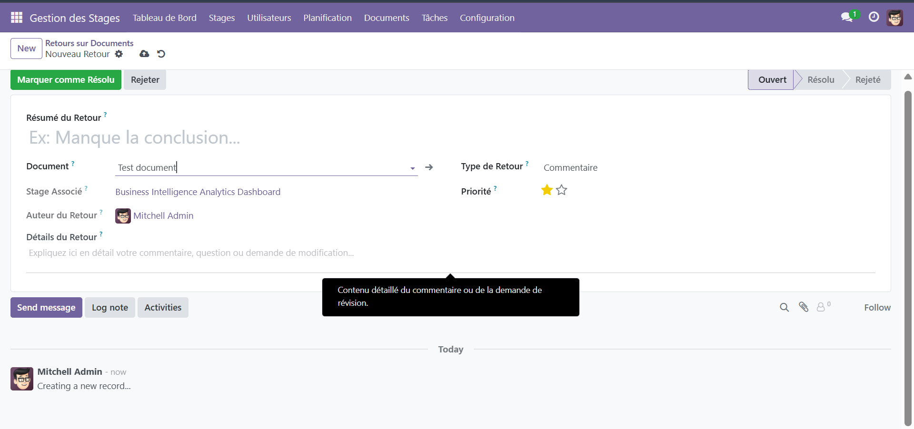

**2. Upload du fichier**

Cliquer sur "Parcourir"
Sélectionner le fichier (PDF, Word, PPT acceptés)
Max 50 MB


**3. Description (optionnel)**
Ajouter des informations sur le contenu du document

**4. Soumettre**

Cliquer sur "Enregistrer" (brouillon)
Cliquer sur "Soumettre pour Révision"
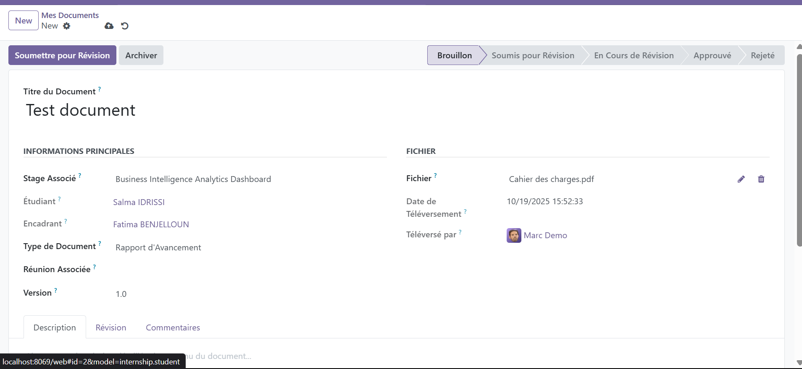


#### Suivre le statut d'un document

**Menu** : `Documents > Mes Documents`

**Statuts possibles** :
- 🟦 **Brouillon** : Non encore soumis
- 🟡 **Soumis** : En attente de révision
- 🟠 **En Révision** : L'encadrant examine
- 🟢 **Approuvé** : Document validé
- 🔴 **Rejeté** : Modifications demandées

> **💡 Conseil** : Consultez le Chatter pour voir les commentaires de l'encadrant.

#### Soumettre une nouvelle version

Si votre document est **"Rejeté"** :

1. Lire les commentaires de l'encadrant dans le Chatter
2. Modifier votre document selon les remarques
3. Retourner sur la fiche du document
4. **Modifier** le champ "Version" (ex: 1.0 → 1.1)
5. **Remplacer** le fichier
6. **Re-soumettre pour Révision**

### 4.4.5 Déposer ma présentation

**Menu** : `Documents > Mes Présentations > Créer`

#### Soumettre une présentation de soutenance

**1. Informations**
Titre : [Présentation finale - Projet X]
Stage : [Automatiquement sélectionné]
Version : [1.0]

**2. Upload**
Fichier : [Sélectionner PowerPoint ou PDF]  
Taille max : 50 MB

**3. Date limite (si définie par l'encadrant)**
Affichée automatiquement

**4. Soumettre**  
Cliquer sur "Soumettre pour Révision"   
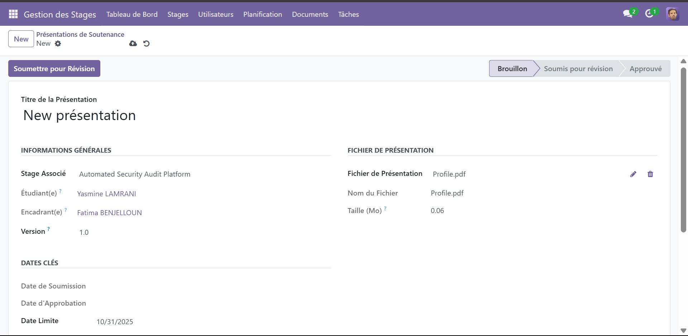


#### Processus de validation

Soumission → Statut "Soumis"
L'encadrant examine
3a. Approuvé → Statut "Approuvé" ✅
3b. Révision requise → Statut "En Révision" ⚠️
Si révision : Corriger et re-soumettre


---

## 5. Fonctionnalités Communes

### 5.1 Le Chatter (Messagerie)

Le **Chatter** est présent sur toutes les fiches (stages, documents, réunions, etc.).

#### Envoyer un message

1. Descendre en bas de la fiche
2. Zone "Envoyer un message"
3. Saisir votre message
4. Cliquer sur "Envoyer"

**Le message est visible par** :
- Les abonnés à la fiche
- Les personnes mentionnées avec @

#### Mentionner quelqu'un

1. Taper `@` puis commencer à écrire le nom
2. Exemple : `@Youssef KADIRI pouvez-vous réviser le document ?`
3. La personne mentionnée reçoit une notification

#### S'abonner à une fiche

1. Cliquer sur "Suivre" en haut à droite
2. Vous recevrez toutes les notifications de cette fiche


### 5.2 Les Activités (To-Do)

Les **Activités** sont des tâches/rappels associés à une fiche.

#### Créer une activité

1. Sur une fiche, cliquer sur l'icône horloge 🕒
2. Remplir :
   - **Type** : Appel, Email, À faire, Réunion
   - **Résumé** : Titre de l'activité
   - **Date d'échéance**
   - **Assigné à** : Utilisateur responsable
3. Cliquer sur **"Planifier"**

#### Marquer une activité comme terminée

1. Ouvrir l'activité (icône horloge)
2. Cliquer sur **"Marquer comme fait"**
3. Ajouter un commentaire (optionnel)


### 5.3 Générer des rapports PDF

**Disponible pour les encadrants et coordinateurs.**

**Menu** : `Sur une fiche de stage > Imprimer`

**Rapports disponibles** :
- **Convention de stage** : Document officiel
- **Attestation de stage** : Certificat de fin de stage
- **Procès-verbal de soutenance** : PV officiel
- **Rapport d'évaluation** : Notes et feedback
- **Rapport de synthèse** : Vue d'ensemble du stage

**Processus** :

1. Ouvrir le stage
2. Onglet **"Rapports"**
3. Cliquer sur le rapport souhaité
4. Le PDF se génère automatiquement
5. Télécharger ou imprimer


### 5.4 Exporter des données

**Format d'export** : Excel (.xlsx)

**Depuis une liste** :

1. Afficher la liste (ex: liste des stages)
2. Cliquer sur l'icône "télécharger" (en haut à droite)
3. Sélectionner les champs à exporter
4. Cliquer sur **"Exporter"**


---

## 6. FAQ (Foire Aux Questions)

### Q1 : J'ai oublié mon mot de passe, que faire ?

**R** : Sur la page de connexion, cliquer sur **"Mot de passe oublié ?"** et suivre les instructions. Un email de réinitialisation sera envoyé.

### Q2 : Comment savoir si mon document a été lu ?

**R** : Vous recevrez une notification dans l'application, et par email si la messagerie est configurée, dès que l'encadrant change le statut du document.

### Q3 : Puis-je supprimer un document ?

**R** : Non, vous ne pouvez pas supprimer un document après soumission. Vous pouvez le marquer comme "Archivé" si nécessaire.

### Q4 : Comment changer l'encadrant d'un stage ?

**R** : Seuls les coordinateurs et administrateurs peuvent modifier l'encadrant. Contactez-les via le Chatter sur la fiche du stage.

### Q5 : Puis-je créer plusieurs stages pour un même étudiant ?

**R** : Oui, un étudiant peut avoir plusieurs stages (ex: stage d'été puis PFE).

### Q6 : Les notifications par email fonctionnent-elles automatiquement ?

**R** : Les notifications sont créées automatiquement dans l'application pour :
- Nouveau stage créé
- Document soumis/approuvé/rejeté
- Réunion planifiée
- Tâche assignée
- Mention dans le Chatter

> **📧 Note** : L'envoi par email nécessite une configuration SMTP. Voir la section 1.4 pour plus de détails.

### Q7 : Comment voir l'historique des modifications ?

**R** : Sur chaque fiche, descendre jusqu'au Chatter. Tous les changements sont tracés.

### Q8 : Puis-je personnaliser mon tableau de bord ?

**R** : Le tableau de bord est automatiquement personnalisé selon votre rôle et ne peut pas être modifié manuellement.

---

## 7. Support

### 7.1 Contacts

**Support technique** :
- 📧 Email : support@techpal.ma
- 📞 Téléphone : +212 522 XX XX XX
- ⏰ Horaires : Lundi-Vendredi, 9h-18h

**Coordinateur des stages** :
- 👤 Nom : [À définir par l'organisation]
- 📧 Email : [À définir]

**Développeur du système** :
- 👤 Nom : SILUE GNINNINMGUIGNON
- 📧 Email : gninhosilue@gmail.com 
- 🐙 GitHub : [https://github.com/Gninho-silue](https://github.com/Gninho-silue)

### 7.2 Signaler un bug

**Via l'application** :

1. Menu utilisateur (en haut à droite)
2. **"Signaler un problème"**
3. Décrire le bug avec captures d'écran
4. **Envoyer**

**Par email** :
- **À** : support@techpal.ma
- **Objet** : `[BUG] Description courte`
- **Corps** :
  - Description détaillée
  - Étapes pour reproduire
  - Captures d'écran
  - Navigateur utilisé


### 7.3 Demander une formation

Pour une formation personnalisée ou en groupe :
- 📧 Email : formation@techpal.ma
- **Durée** : 2h par session
- **Format** : Présentiel ou Zoom
- **Contenu** : Adaptation selon le rôle (Admin, Encadrant, Stagiaire)

---

## 📝 Notes de version

### Version 2.0.0 (Janvier 2025)
- **Restructuration complète** du guide utilisateur
- **Corrections des informations** pour correspondre au système réel
- **Suppression des références** aux images inexistantes
- **Amélioration du formatage** et de la structure
- **Validation technique** avec le code source réel
- **FAQ mise à jour** avec les bonnes informations

### Version 1.0.0 (Octobre 2025)
- Version initiale du guide utilisateur
- Couverture complète des 4 rôles
- FAQ complète

---

**© 2024-2025 TechPal Casablanca - Tous droits réservés**  
**Développé par SILUE dans le cadre d'un stage d'été**